# Introduction

The document describes the installation as well as the use of the LiveObjects library on the platforms
Hardware from STMicroelectronics.
The LiveObjects library is based on version 6.1 of XCubeCellular. It is a middleware offered by
STMicroelectronics which makes it possible to develop TCP/IP applications (HTTP, MQTT, etc.)
transparent on the basis of API.
The LiveObjects library is compatible with version 5.2 of XCubeCellular. She uses libraries
additional such as:

- Json
- XCubeCellular Library
- FreeRTOS

The application runs on the FreeRTOS real-time OS (https://fr.wikipedia.org/wiki/FreeRTOS)
IoT devices communicate with LiveObjects in MQTT. This stack is integrated in this same
library.
It is validated on the following cards:

- Discovery P-L496G-CELL02 + the SEQUANS GSM01Q cellular module

- STEVAL-STWINKT1 + the SEQUANS GSM01Q cellular module
  But it is possible to port the library to other STM32 platforms.

  
<p align = "center">
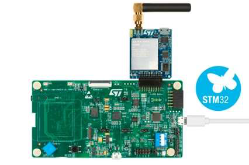
</p>
<p align = "center">
Fig.1 - P-L496G-CELL02
</p>

<p align = "center">
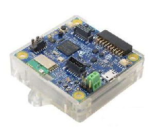
</p>
<p align = "center">
Fig.2 -STEVAL-STWINKT1
</p>

The licence is MIT

# Installation

### Installation of the development environment

The development environment used is STM32CubeIDE. It is based on the Eclipse IDE. 
He can be downloaded directly from https://www.st.com/en/developmenttools/stm32cubeide.html

The installation procedure is described for all environments in the document titled **"STM32CubeIDE Installation guide – User manual"**
(https://www.st.com/resource/en/user_manual/dm00603964-stm32cubeide-installation-guidestmicroelectronics.pdf)

The library can be downloaded from the Orange Github at https://github.com/Orange-OpenSource. 

The project is called LiveObjects-4-XCubeCellular and is available under the **MIT** license.
For a good follow-up of the project it is advisable to use the decentralized version management tool **Git** (https://fr.wikipedia.org/wiki/Git).

The project only embeds the part specific to Live Objects. It is therefore essential to install XCubeCellular from the STMicroelectronics repository (http://)


## First step : Create LiveObjects account

Creating a LiveObjects Account
Developing an application requires creating a LiveObjects account.
Registration at https://liveobjects.orange-business.com/#/liveobjects is free for a limited number of items.
After recording, be sure to save the Master key displayed on the screen. This one can no longer be consulted.

- Connected objects mainly use MQTT to interface with the platform. To do this, a key must be created to communicate through this protocol.
  Go to the Administrator menu and then click on API keys to the left of the screen.


<p align = "center">
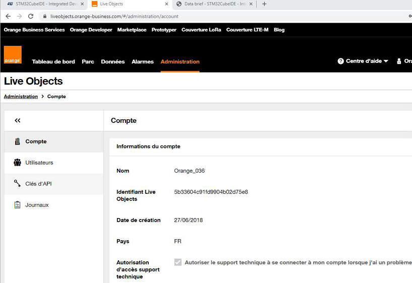
</p>


- Then click on the Add button

  

  <p align = "center">
  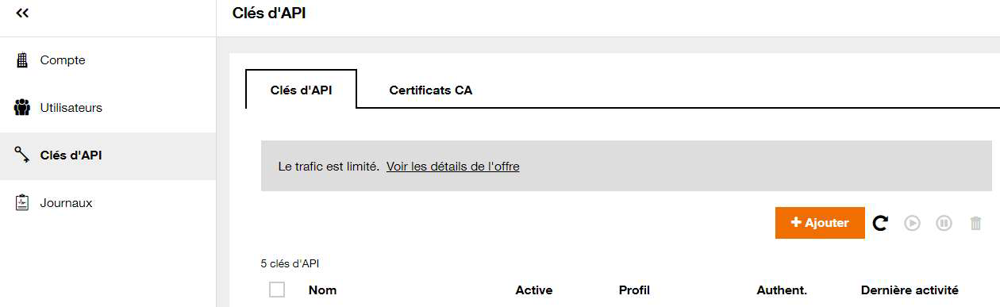
  </p>
  
  
  
  
- Enter the different fields such as name, description, etc… then select “MQTT Equipment” and click on create.


<p align = "center">
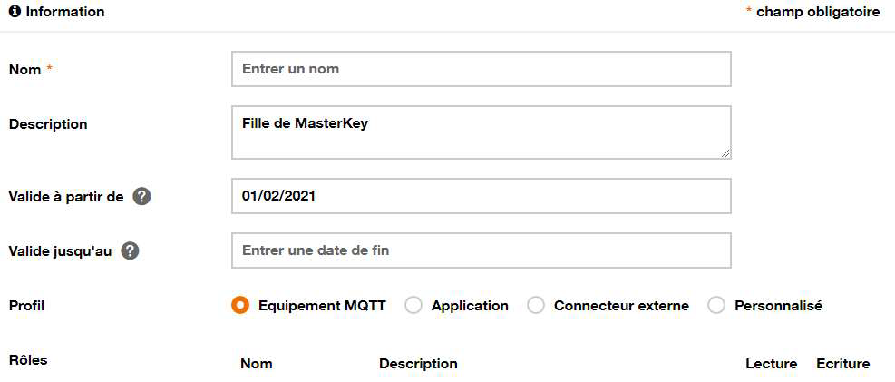
</p>


- The key is then generated. It is necessary to store or save it to its future use within the embedded application


<p align = "center">

</p>


## Last step : Import LiveObjects4XCubeCellular project

After installing the XCubeCellular library, place the LiveObjects project directory in the root directory **/XCubeCellular-V6.1**

N.B: The library must imperatively be placed at this level to be able to be used


<p align = "left">
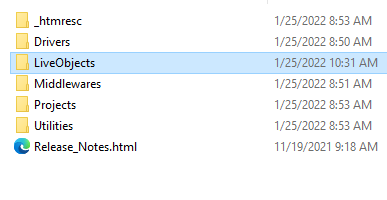
</p>

The library comes with an example of a basic application for connecting and exchanging data with the LiveObjects platform.

Open the STM32CubeIDE development environment, then click on File-Import

<p align = "left">
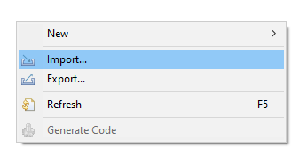
</p>

```sh
The project type selection window appears.
```

<p align = "left">
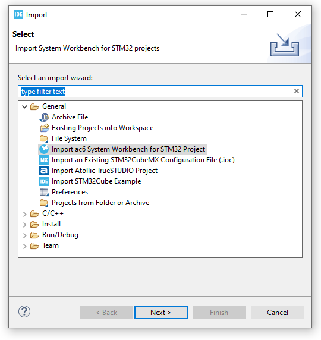
</p>

Click on the Directory button “Import ac6 System Workbench for STM32 Project” then select the directory:

**XCubeCellular-V6.1\LiveObjects\samples\DiscoL496_GM01Q** for the Discovery L496 GM01Q

and

**XCubeCellular-V6.1\LiveObjects\samples\STWINKT1_GM01Q** for STWINKT1


```sh
The project appears in the project explorer as above.
```


<p align = "left">
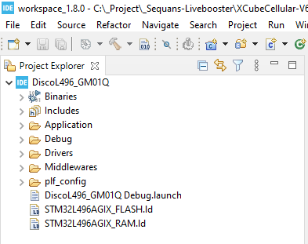
</p>


## Running application

### Setting up the application

All LiveObjects connection parameters are defined in a single file that carries the name **liveobjects_conf.h**

<p align = "left">
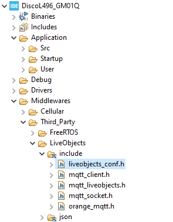
</p>


- Enter the previously generated password (API key) at the occurrence ***MQTTCLIENT_DEFAULT_PASSWORD***

- Enter the subject name (clientID) where applicable ***MQTTCLIENT_DEFAULT_CLIENTID***
- Modify the StreamID if needed at the ***MQTT_DEFAULT_STREAM_ID*** occurrence


### Setting up the application

Compile and run the program. This one, after connection, will send the IMEI, the IMSI as well as the name

from the module to the LiveObjects cloud in JSON format.
It is possible to check the status of the connection as well as the data sent on the LiveObjects dashboard.


### App structure 

The application runs on FreeRTOS. All the libraries are in the project directory “Third_Party” itself present in “Midllewares”.


There you can find the source code of:
- FreeRTOS OS

- Json-parser open source library

- From the LiveObjects library

  Note that the LiveObjects library includes its own MQTT stack. Indeed, this is intrinsic to the library.
  The ST libraries are in the “Cellular”.
  It is recommended not to modify all of these files, otherwise you may create malfunctions of the final application.
  The application is placed in the “Application/User” directory. We find there the file “main.c” which
  instantiates the main Thread which, itself instantiates the one that manages the execution of the cellular part (liveobjects_app.c).

### Cellular Connectivity Initialization

We will focus later on the process present in the file **liveobjects_app.c**

All LiveObjects APIs are defined in the **mqtt_liveobjects.h** file. This is documented under Doxygen.
When starting the Thread LiveObjects task, a LiveObjects instance is created by calling the lo_create() function. If successful, it returns a handle that will be used for all calls to APIs.

You must then assign the configuration by calling **lo_set_default_config(handle);**
This function assigns to the handle all the connection parameters defined in the file of **config “liveobjects_conf.h”**
It is nevertheless possible to define them ad hoc using the **lo_set_default_config function.**

Following this, we can connect to the network by calling the function **lo_connect_mqtt(handle)**. This function initializes the module, hooks up the cellular network and then initiates an MQTT connection to LiveObjects. If it succeeds, we define the different callback and subscriber.


In our example, we want to be notified of the receipt of orders:
**lo_set_command_callback(handle, lo_command_callback);**
**lo_command_subscribe(handle);**

### Publishing a message to the LiveObjects platform

For the proper functioning of the sending and the response of an MQTT message, it is essential to periodically check that the connection is still active using the function
**lo_is_connected(handle)** and then call the **lo_synchronize(handle)** method which allows processing of MQTT exchanges and, if necessary, triggering callbacks.
In our example we publish the Json message which includes the IMEI, the IMSI as well as the name of the device with the following procedures:

```sh
sprintf(buffer, (const char*)"{\"opname\":\"sequans002\",\"imei\":\"%s\",\"imsi\":\"%s\"}",  cellular_info.imei, cellular_sim_info.imsi);
lo_publish_data(handle, (const char*) buffer);
```


### Programming and sending a command

It is possible, in our example, to receive commands from LiveObjects.
From the LiveObjects site, go to the list of devices then select the equipment on which the command must be sent


<p align = "left">
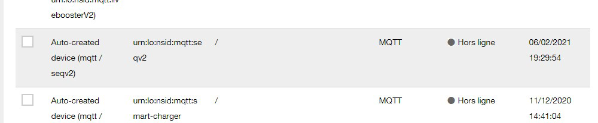
</p>


The equipment supervision screen appears. We will notice a list of possible actions on the left of the screen, including the one for sending commands (Downlink).

Click on this item to enter the input menu.

<p align = "left">
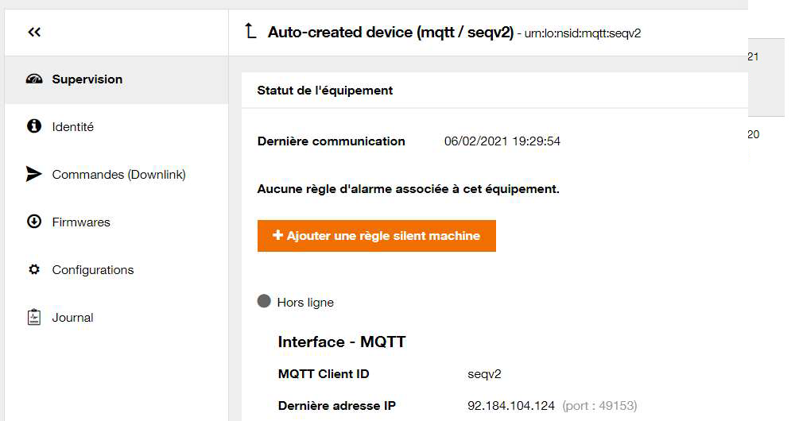
</p>


Then on the button "Add an order.

<p align = "left">
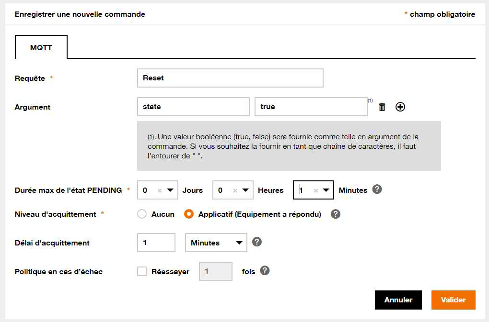
</p>

The command is made up of the name of the request (json “req” tag), then the argument (in our case of **“state”** with the value **“true”**). It is also mandatory to define the duration maximum Pending.

Following this the validation will publish the message in MQTT. The test application will receive the command.
The callback **lo_command_callback(int64_t cid, const char* req, const json_value* arg)**is called. We can perform the tasks associated with the request (published in the variable req and arg)
We will not forget to call the **lo_publish_ack_command** function to validate or invalidate the command

## License

MIT
